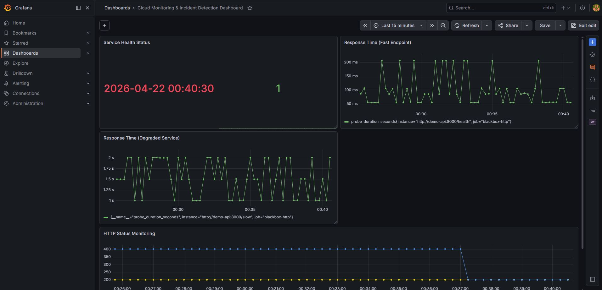
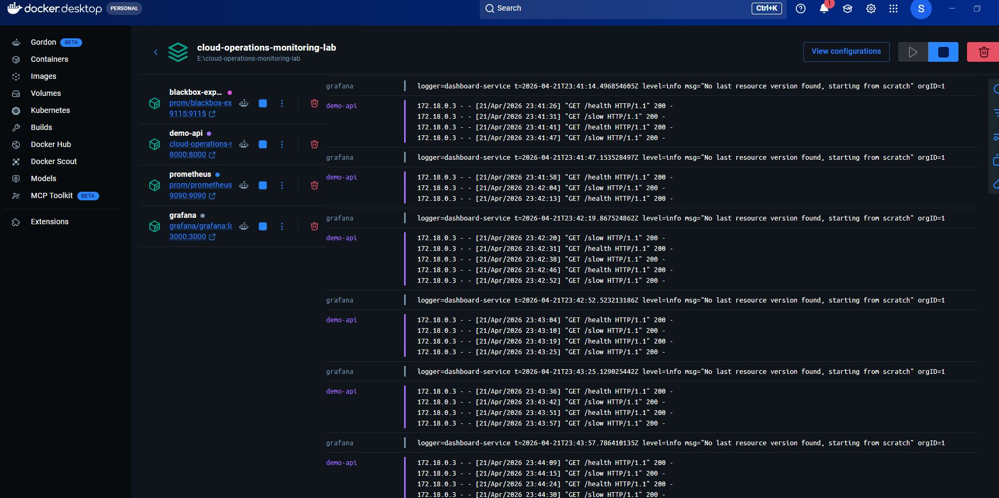
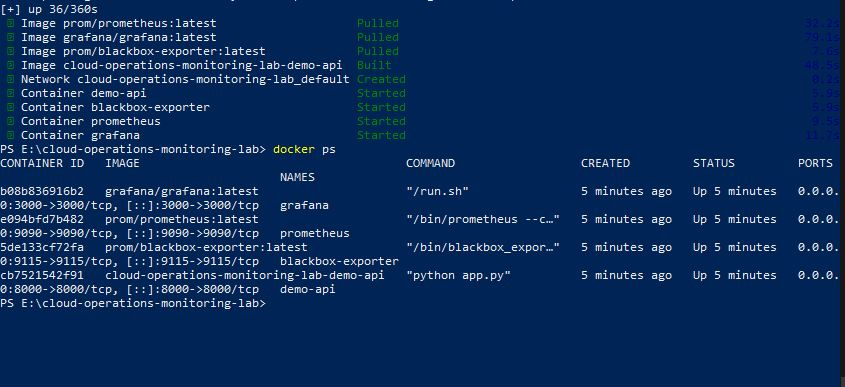
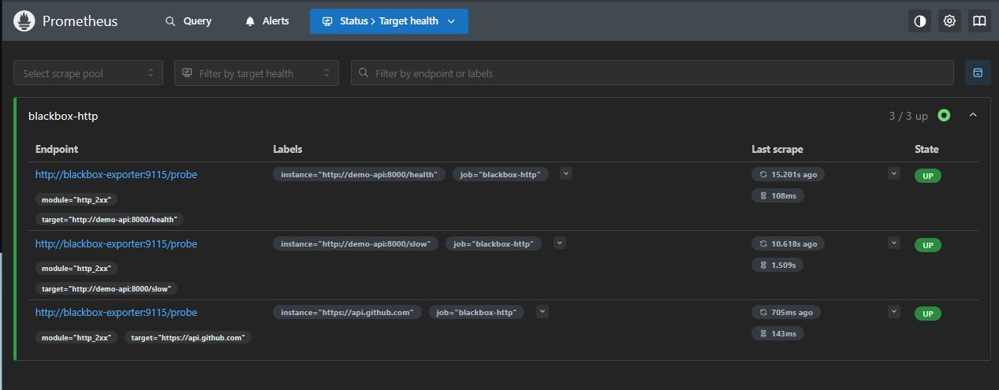
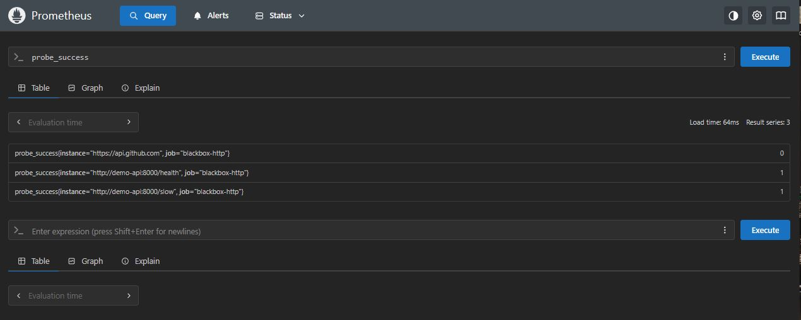

# 📊 Cloud Monitoring & Incident Detection Lab

<p align="center">
  
  
  
  
</p>

> ⚠️ This project runs locally using Docker. The screenshots below show the stack fully running with live metrics and dashboard data.

## 🚀 Overview

A production-style observability project built with Docker, Prometheus, and Grafana to simulate real-world cloud monitoring and incident detection.

This lab demonstrates:

- Service uptime monitoring  
- API latency tracking  
- Performance degradation simulation  
- HTTP status monitoring  
- Real-time dashboard visualization  

## 🧱 System Architecture

```text
Prometheus → Blackbox Exporter → API Endpoints
                         ↓
                      Grafana
```

## 📁 Project Structure

```text
cloud-operations-monitoring-lab/
│
├── demo_api/
│   ├── app.py
│   ├── Dockerfile
│   └── requirements.txt
│
├── monitoring/
│   ├── blackbox/
│   │   └── blackbox.yml
│   ├── grafana/
│   │   ├── dashboards/
│   │   │   └── starter_dashboard.json
│   │   └── provisioning/
│   │       ├── dashboards/
│   │       └── datasources/
│   └── prometheus/
│       └── prometheus.yml
│
├── scripts/
│   ├── alerting.py
│   ├── detect_incidents.py
│   ├── generate_logs.py
│   ├── generate_ticket.py
│   ├── uptime_check.py
│   └── visualize_metrics.py
│
├── images/
│   ├── dashboard_overview.png
│   ├── docker_desktop_running.png
│   ├── docker_ps.jpg
│   ├── prometheus_query_probe_success.png
│   └── prometheus_targets.png
│
├── docker-compose.yml
├── requirements.txt
└── README.md
```

## 📊 Monitoring Dashboard



### Key Panels

- **Service Health Status** → uptime monitoring using `probe_success`  
- **Response Time (Fast Endpoint)** → baseline latency for the healthy endpoint  
- **Response Time (Degraded Service)** → simulated slow-service behaviour  
- **HTTP Status Monitoring** → status code tracking over time  

## 🐳 Container Infrastructure

### Docker Desktop



### Active Containers (`docker ps`)



Running services:

- Prometheus  
- Grafana  
- Blackbox Exporter  
- Demo API  

## 📡 Prometheus Monitoring

### Target Health Status



All monitored targets are actively scraped and reporting health/latency data, including:

- Fast local endpoint (`/health`)  
- Degraded local endpoint (`/slow`)  
- External API endpoint (GitHub API)  

## 🔍 Metrics Query Example



```promql
probe_success
```

| Value | Meaning |
|------|--------|
| `1` | Service is UP |
| `0` | Service is DOWN |

## 📈 Performance Monitoring

### Fast Endpoint (`/health`)
- ~50–200 ms  
- Stable behaviour  

### Degraded Endpoint (`/slow`)
- ~1–2 seconds  
- Simulated latency issues  

This setup allows:

- performance comparison  
- anomaly detection  
- incident simulation  

## ⚙️ How It Works

1. Prometheus scrapes endpoints through Blackbox Exporter  
2. Blackbox performs HTTP probes against the demo services  
3. Metrics such as `probe_success`, `probe_duration_seconds`, and `probe_http_status_code` are collected  
4. Grafana visualizes the metrics in a dashboard for monitoring and investigation  

## 🧪 Environment

This project was developed and tested locally using:

- Docker Desktop  
- Docker Compose  
- Prometheus  
- Grafana  
- Blackbox Exporter  
- Python / Flask  

All screenshots in this repository were captured from the fully working local environment.

## 🧠 Skills Demonstrated

- Monitoring system design  
- Observability (metrics, uptime, latency)  
- Docker-based infrastructure  
- Prometheus and PromQL  
- Grafana dashboard creation  
- Incident simulation and analysis  

## 🔮 Future Improvements

- Alerting with Prometheus Alertmanager  
- Slack / email notifications  
- Log monitoring with ELK or a SIEM stack  
- Kubernetes deployment  
- SLO / SLA tracking  

## 👤 Author

**Igor Moreira**

## 💼 CV Bullet

Built a containerized cloud monitoring system using Prometheus and Grafana, implementing real-time service health tracking, latency analysis, and incident simulation across multiple endpoints.
